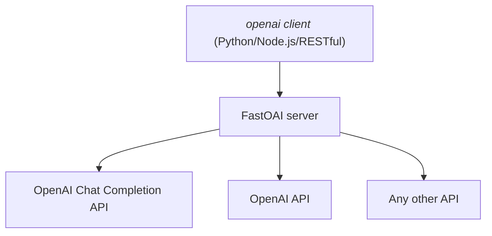

# FastOAI (OpenAI-like API Server)

## Motivation

This project is a simple API server that can be used to serve language models.
It is designed to be simple to use and easy to deploy. It is built using
[FastAPI](https://fastapi.tiangolo.com/), [Pydantic](https://docs.pydantic.dev/)
and [openai-python](https://github.com/openai/openai-python).

## Quick Start

The following [example](./examples/main.py) shows a case to overriding the
original streaming response, we append `[ollama]` to every chunk content.


```python
from fastapi.responses import StreamingResponse
from fastoai import FastOAI
from fastoai.requests import CompletionCreateParams
from fastoai.routers import router
from openai import AsyncOpenAI

app = FastOAI()


@app.post("/chat/completions")
async def create_chat_completions(params: CompletionCreateParams):
    client = AsyncOpenAI(api_key="ollama", base_url="http://localhost:11434/v1")
    response = await client.chat.completions.create(**params.model_dump())
    if params.stream:

        async def _stream():
            async for chunk in response:
                for choice in chunk.choices:
                    choice.delta.content += " [ollama]"
                yield f"data: {chunk.model_dump_json()}\n\n"
            else:
                yield "data: [DONE]\n\n"

        return StreamingResponse(_stream())
    return response

# Order matters, you should firstly define your own entrypoint functions, then
# include the existing router in order to override the original process with
# yours
app.include_router(router)
```

And that's it! You can now run the server using `uvicorn`:

```bash
uvicorn examples.main:app --reload
```

## Architecture


